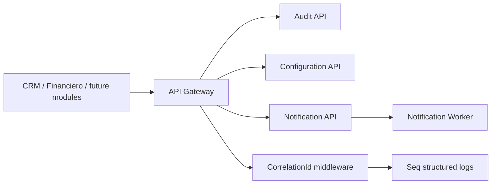

# Portal Audit / Configuration / Notification Architecture

## Crosscutting Flow

## Current Implementation

- Audit API persists append-only audit logs with redaction behavior in the domain.
- Configuration API resolves scoped values by global, tenant, module and user metadata.
- Notification API stores templates/messages and uses development providers.
- Notification worker processes pending messages from Portal Notification database.
- Integration worker is present and disabled by default.
- Building blocks add structured logging, Seq sink and correlation ID middleware.

## Consumer Boundary

Consumers must call Portal APIs through Gateway and include correlation context. They must not share Portal databases, duplicate notification delivery engines or store crosscutting configuration secrets in their own domain runtime.
