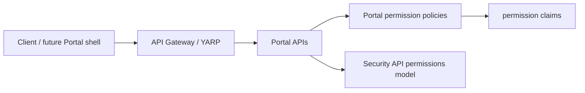

# Portal Auth / SSO / Session Architecture

## Current Auth Flow

## Current Implementation

- API Gateway validates JWT bearer tokens.
- Security, Menu, Audit, Notification and Configuration APIs validate JWT bearer tokens.
- `AddPortalPermissionAuthorization` centralizes permission policies using the `permission` claim.
- Gateway YARP routes require the default authorization policy.

## Future SSO Direction

OIDC/OAuth2 must be introduced as a separate production gate. The provider metadata, client IDs, redirect URIs and secrets must be configured through environment/secret stores, never hardcoded in Git.

## Session Boundary

P3 does not implement browser session storage. `localStorage` and `sessionStorage` are not approved for access-token storage.

## Consumer Boundary

CRM and Financiero consume Portal Auth contracts. They may register domain-specific resources and permissions but must not duplicate identity, login, SSO or global permission ownership.
