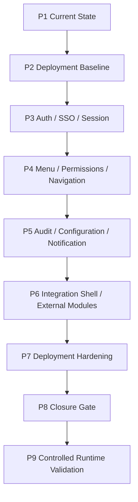

# Portal Baseline Closure Architecture

## Closure view

## Baseline capabilities closed

- API Gateway foundation.
- Security and permission foundation.
- Menu and navigation metadata foundation.
- Audit, Configuration and Notification foundations.
- Worker and SQL Outbox/Inbox foundation.
- Health, readiness, logging and correlation foundation.
- External module onboarding contract.
- Deployment hardening documentation and guardrails.

## Architecture boundaries

- Production remains NoGo.
- CRM and Financiero remain consumers, not embedded runtime dependencies.
- Logical databases remain owned by each bounded context.
- Secret provider, SSO/OIDC and frontend shell buildability are future gates.
