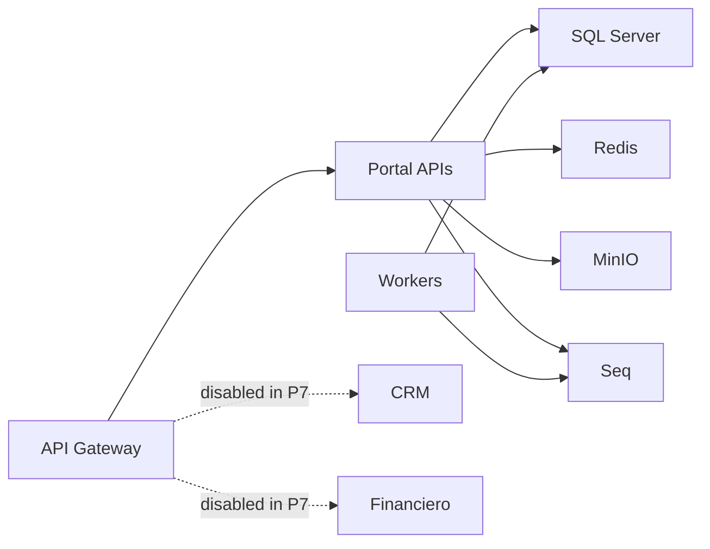

# Portal Deployment Hardening Architecture

## Baseline

PortalCorporativo uses a local compose baseline with:

- API Gateway.
- Portal APIs.
- Notification and Integration workers.
- SQL Server.
- Redis.
- MinIO.
- Seq.

The baseline is suitable for controlled non-production validation only.

## Deployment boundaries

## Hardening requirements

- Render deployment config before runtime startup.
- Validate health/readiness and smoke checks in controlled runtime.
- Keep external module runtime disabled.
- Keep real secrets outside git.
- Keep rollback and recovery independent per bounded context.

## Non-goals

- No production deployment.
- No production credentials.
- No private URLs.
- No CRM or Financiero runtime activation.
- No destructive infrastructure changes.
