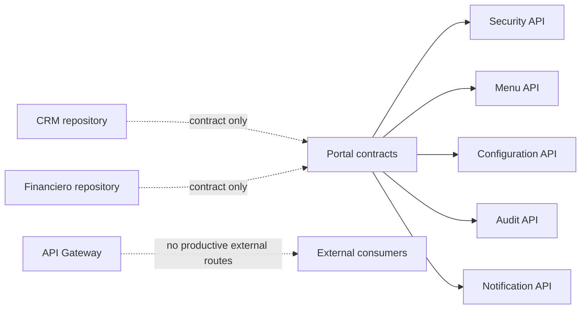

# Portal External Consumer Onboarding Architecture

## Boundary model

| Boundary | Rule |
| --- | --- |
| Runtime | CRM and Financiero are not Portal runtime dependencies |
| Gateway | No productive external Gateway routes in Sprint 16 |
| Navigation | No productive external navigation in Sprint 16 |
| Database | Separate logical databases; no shared tables or cross-domain migrations |
| Deployment | Portal and consumers deploy independently |
| Security | Portal owns platform authorization contracts |
| Crosscutting | Portal owns Audit, Configuration and Notification contracts |

## Database boundary

Portal databases are owned by Portal platform capabilities. Consumer databases are owned by their repositories. A shared local SQL Server container may exist as infrastructure, but databases, schemas, tables and migrations must remain logically separated.

Sprint 16 database rules: no DB compartida, no tablas compartidas and no migraciones cruzadas between Portal, CRM and Financiero.

## Deployment boundary

Portal Compose must not start CRM or Financiero services. Consumer runtime onboarding requires a later explicit gate.
