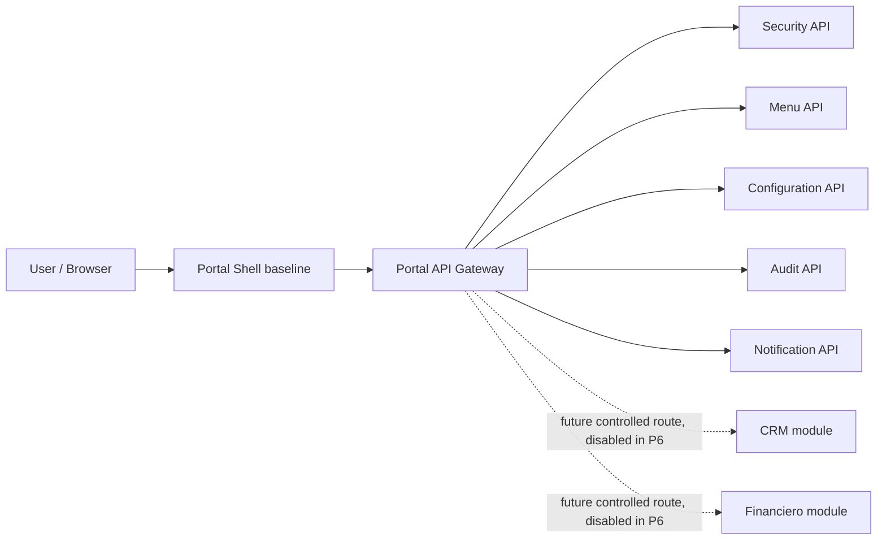

# Portal Integration Shell / External Modules Architecture

## Decision

Portal Sprint P6 defines a controlled baseline for future external modules, including CRM and Financiero, without enabling productive runtime integration.

- IntegrationShellBaselineReviewed: true.
- ExternalModuleOnboardingContractPrepared: true.
- GatewayExternalModuleBoundaryReviewed: true.
- ConsumerModuleBoundaryReviewed: true.
- ProductionActivationDecision: NoGo.
- ProductiveExternalModuleRuntimeEnabled: false.
- ProductiveExternalNavigationEnabled: false.
- ProductiveExternalGatewayRoutesEnabled: false.
- RealCrmRuntimeCouplingPresent: false.
- RealFinancialRuntimeCouplingPresent: false.
- SharedDatabaseWithConsumersPresent: false.

## Architecture intent

PortalCorporativo remains the platform owner for cross-cutting capabilities:

- Security and permission decisions.
- Menu and navigation metadata.
- Gateway policy boundary.
- Audit, configuration and notification contracts.
- Correlation, health checks and structured logging.

External modules are consumers. They may register module metadata, resources, permissions, menu entries and integration contracts, but they must not become part of the Portal runtime by default.

## Baseline topology

## Runtime boundary

P6 does not add productive routes for CRM or Financiero. The gateway continues to expose only Portal-owned services. Future consumer routes require an explicit gate, route review, authorization policy, health contract and deployment decision.

## Data boundary

Portal, CRM and Financiero must not share a logical database. A local environment may reuse one SQL Server container, but each domain owns its own database and schema.

## Shell boundary

The shell may display module placeholders or contracts in documentation only. Productive external navigation remains disabled until a later sprint validates auth, menu, permissions, gateway routing, operational ownership and rollback.

## Non-goals

- No real CRM or Financiero runtime coupling.
- No private URLs or productive destinations.
- No real tokens, certificates, credentials or environment files.
- No frontend production shell implementation.
- No direct database access across bounded contexts.
