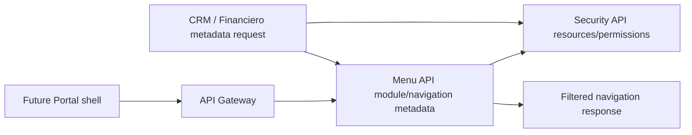

# Portal Menu / Permissions / Navigation Architecture

## Flow

## Current Implementation

- Menu API stores menu definitions, menu items and menu actions.
- Menu items include route, resource key and permission code.
- Menu visibility checks call Security API permission decisions.
- Security API owns resources, permissions, role-permission and user-role assignments.
- Gateway protects route groups with authorization policy.

## External Module Navigation

CRM and Financiero navigation must be declared as metadata contracts. P4 does not activate productive external navigation. Future activation requires safe route prefixes, permission mapping, UI shell validation and Gateway route review.
