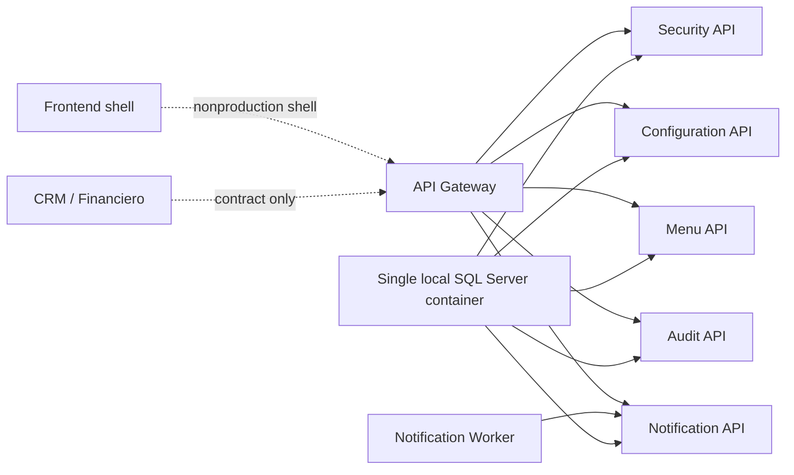

# Portal NonProduction Release Candidate Architecture

## RC architecture posture

- Portal services run as a self-contained NonProduction stack.
- Consumers remain contract-only.
- The local SQL Server container is shared infrastructure only; logical Portal databases remain separated.
- No CRM or Financiero service is part of the Portal Compose runtime.
- No production SSO/OIDC, Secret Provider or Notification Provider is enabled.

## Promotion boundary

Sprint 17 approves only the next package gate: `PortalSprint18ControlledNonProductionDeploymentPackage`.
