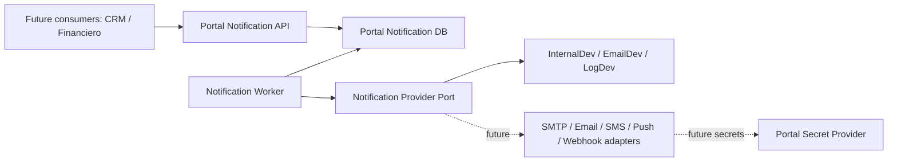

# Portal Notification Provider Architecture

## Component separation

## Responsibilities

| Component | Responsibility | Must not own |
| --- | --- | --- |
| Notification API | Accept requests, enforce permissions, create messages, apply idempotency | Provider credentials or external delivery |
| Notification Worker | Poll due messages, call provider port, apply retry and terminal status | Consumer domain logic |
| Provider adapter | Deliver one message through a configured channel | Templates, queue ownership or retry scheduling |
| Secret Provider | Resolve future provider credentials | Notification state |
| Consumers | Request notifications by contract | Global notification engine or provider credentials |

## Current providers

The current runtime uses development providers only:

- `InternalDev`.
- `EmailDev`.
- `LogDev`.

They must not send real email, SMS, push or webhook messages.

## Future adapters

Future adapters must be introduced behind an explicit provider gate and must use logical secret names only. Production delivery must remain disabled until provider evidence, rollback and operational ownership are approved.
